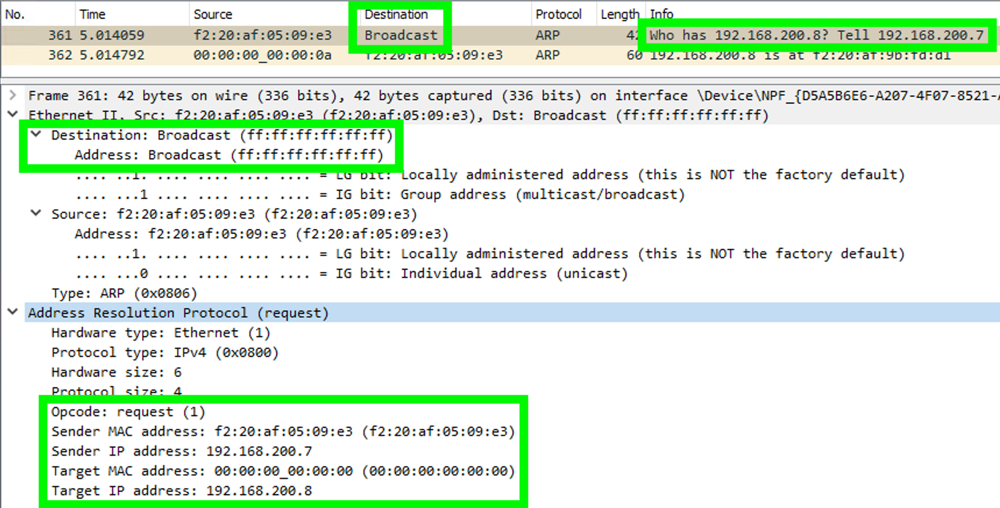
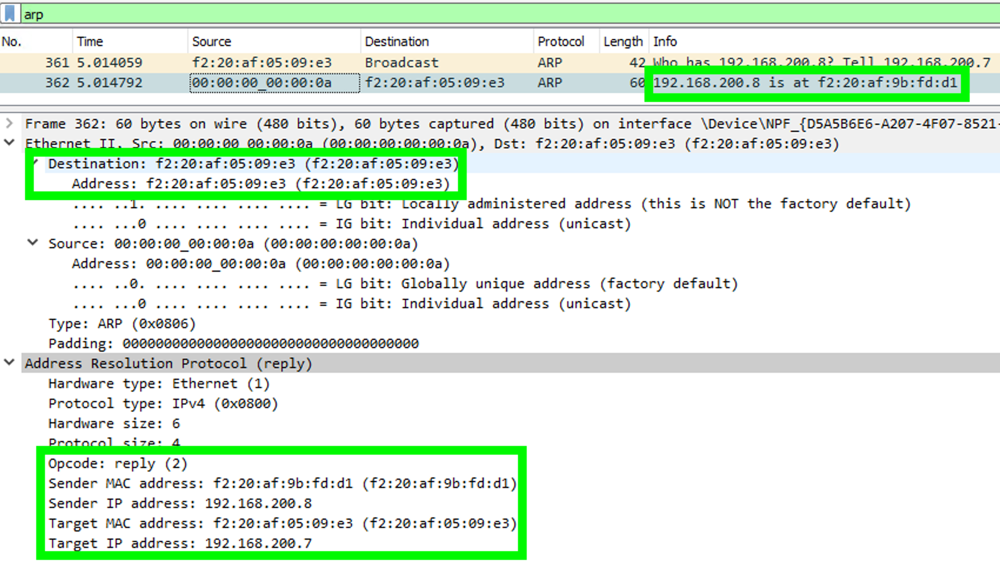
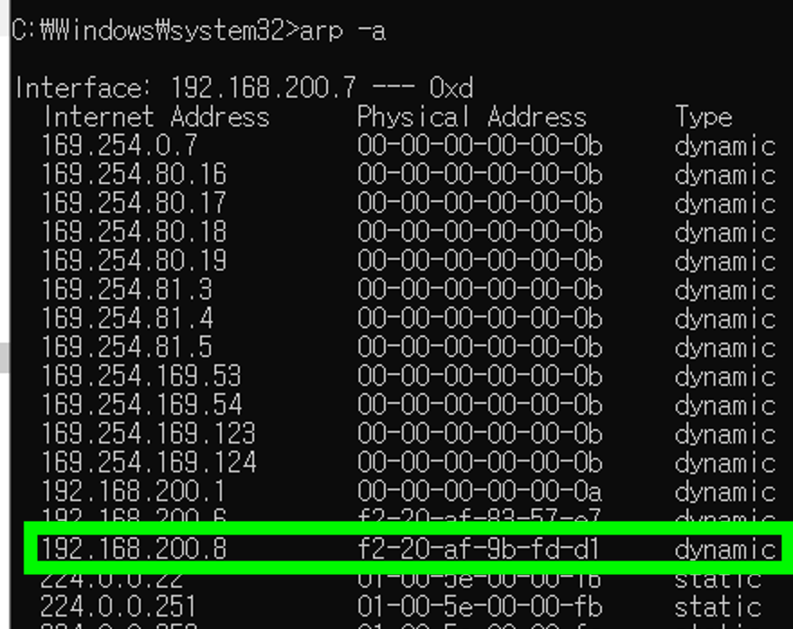

### Data Link Layer
물리 계층은 비트열을 전기신호로 변환하여 케이블로 전송한다.  
누구에게 전송하는 지, 중간에 데이터가 변경되거나 누락되지는 않았는 지 등은 체크하지 않는다.  
<b>데이터 링크 계층에서는 물리 계층의 신뢰성을 확보할 수 있도록 돕는다.</b>

그렇다면, 전기신호 이외에 어떤 정보들을 추가로 전송할까?  
물리 계층을 '프레임 화'한 데이터 링크 계층에서는 아래 3가지 정보를 추가하여 '프레임 화'한다.

### Data Link Layer 에서 프레임화하는 정보

~~~
- Preample: 데이터 링크 계층의 프레임이 시작됨을 알리는 8바이트의 비트배열이다. 정해진 8개의 바이트를 destination에서 받으면, "이제 데이터 링크 계층의 데이터가 시작되는구나"라고 알 수 있다.

- Header: 총 4가지 정보를 포함한다.
    - source mac address: 데이터를 보내는 송신자의 mac address이다.
    - destination mac address: 데이터를 보내고자 하는 수신자의 mac address이다. ARP 에서는 수신자의 mac address 를 모르기 때문에 일단 broadcast(ff:ff:ff:ff:ff:ff)를 하여 mac address 를 알아내고자 한다.
    - type: 전송하고 있는 데이터 부분의 패킷이 어떤 프로토콜을 사용하는 지 정의한다. 상위 계층의 프로토콜에 의해 값이 이미 정해져 있다.       
    - packet: 상위 계층으로부터 수신하는 데이터이다. 최대 크기는 기본적으로 1500 byte이다. 일단 이 정도만 알고 넘어간다. 
    
- FCS 
    - 데이터가 송수신 과정에서 망가지지 않았는 지 체크하는 필드이다. 
~~~    
    
    
### ARP protocol
Address Resolution Protocol의 약어이다. IP주소를 물리적 네트워크 주소로 대응하기 위해서 사용된다.  
IP주소는 알고 있지만, mac address를 모르는 상황에서 mac address를 알아내야 할 때 쓰인다는 의미이다.  
arp를 직접 사용해보자.

#### practice
~~~
source: 192.168.200.7
destination: 192.168.200.8
command: ping -n 1 192.168.200.8
~~~

##### arp request  

##### arp response  

#### arp table
아래의 명령어를 통해, 현재 arp 테이블에 등록된 ip와 mac address 를 알 수 있다.  
Type이 dynamic 인 것은 시간이 지나면 삭제된다.   
테이블에 이미 등록된 정보로 다시 호출하면, broadcast는 일어나지 않는다.   

~~~sh
# arp 에 cache 된 데이터를 확인할 수 있다.
arp -a

# arp 에 cache 된 데이터를 삭제한다.
arp -d ${ip}
~~~

### Reference
- 인프라/네트워크 엔지니어를 위한 네트워크 이해 및 설계 가이드
- https://ko.wikipedia.org/wiki/%EC%A3%BC%EC%86%8C_%EA%B2%B0%EC%A0%95_%ED%94%84%EB%A1%9C%ED%86%A0%EC%BD%9C