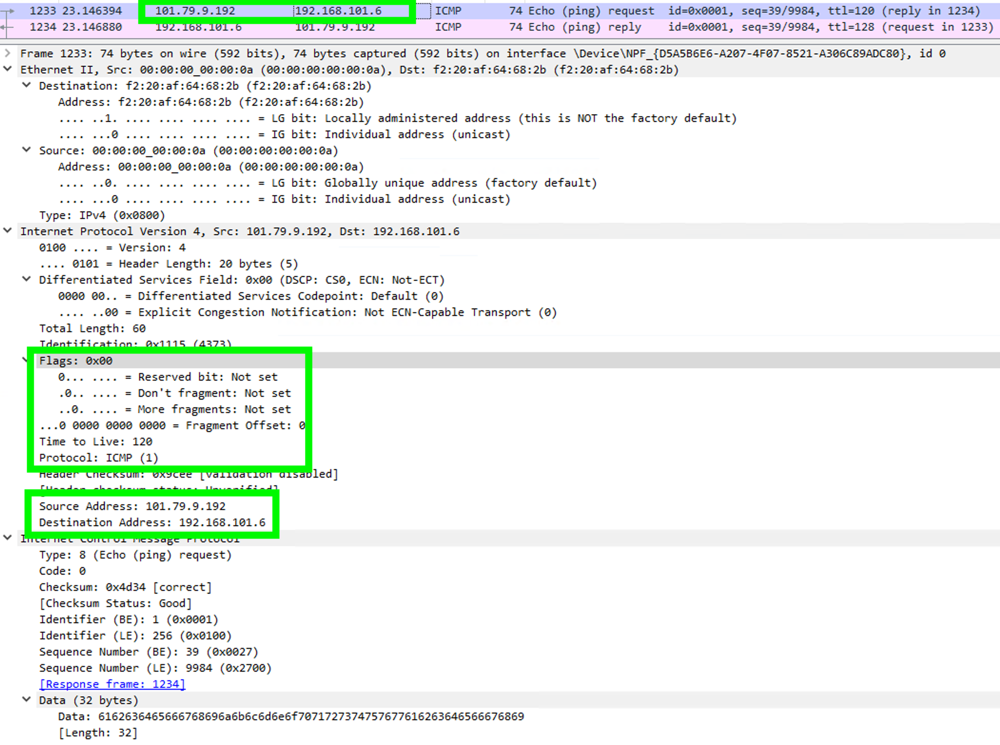
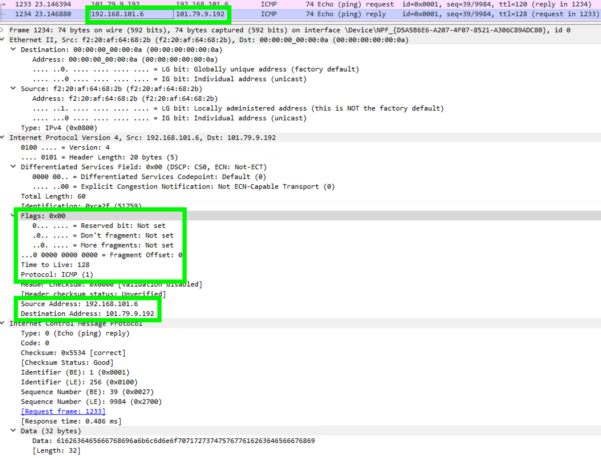

### Network Layer
데이터 링크 계층의 역할은 동일한 네트워크에 존재하는 노드들의 연결까지이다.  
한국 vm에서 싱가폴 vm으로 통신을 하려면, 데이터 링크 계층만으로는 부족하다.  
예를 들어, 한국 vpc 에 속한 vm의 private ip와 싱가폴 vpc에 속한 vm의 private ip가 같다면?

### Network Layer 에서 패킷화하는 정보
네트워크 계층에서는 데이터 링크 계층에서 만들어진 정보를 바탕으로, 다른 네트워크에 존재하는 노드와 통신할 수 있도록 추가 데이터 처리를 한다.  
IP 헤더를 부가처리하는데 이를 '패킷화'라고 하며, '패킷화'에 의해 만들어진 데이터를 'IP 패킷'이라고 한다.  
아래 practice를 통해, IP 패킷에 대해서 알아본다.

### practice

~~~
source: 
    private ip: 192.168.200.7 (/24)
    public ip: 101.79.9.192
destination: 
    private ip: 192.168.101.6 (/24)
    public ip: 110.234.194.252

command: ping -n 1 110.234.194.252
~~~

~~~
단편화 관련 필드 3가지
    Identification: 무작위로 할당된다. IP 패킷의 크기가 MTU를 초과해서 단편화하여 전송해야 하는 경우, 수신자에서 이 값으로 재합성한다.
    Flags: 3비트로 구성되어있다. 상위 1비트는 사용하지 않는다.
        Don't fragment bit (DF bit): 0이면 단편화 허용을 의미하며, 1이면 불허를 의미한다.
        More fragment bit (MF bit): 1이면 뒤따르는 비트가 있음을 의미하고, 0이면 마지막 비트를 의미한다.
    Fragment offset: 단편화된 패킷이라면, 몇 번째 패킷인지를 의미한다.

TTL(Time to Live): 경유할 수 있는 라우터의 수, '홉(hop) 수'라고도 한다.

Protocol: 1은 ICMP이며, 6은 TCP이다. 그렇다.
~~~

##### icmp request  

##### icmp response  
