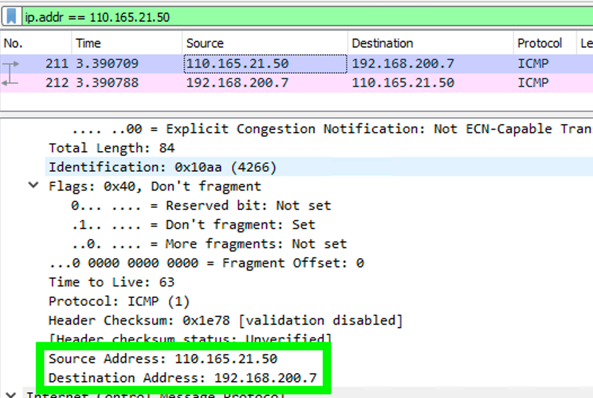
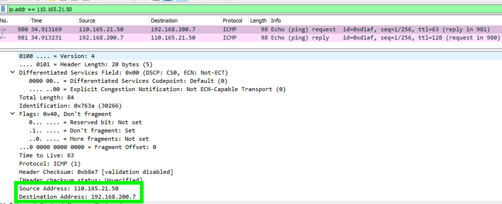

### NAT (Network Address Translation)
네트워크 계층에서 패킷의 IP address를 변환하는 기술을 의미한다.  
NAT에는 작동방식에 따라 여러가지가 있지만, 많이 쓰는 방식은 '정적 NAT', '네트워크 주소 포트 변환(NAPT, Network Address Port Translation)', 'Twice NAT' 가 있다.  
앞의 두 가지만 알아보자.

### 정적 NAT (1:1 NAT)
정적 NAT는 내부와 외부의 IP address를 1:1로 연관지어 변환한다. 그래서 '1:1 NAT' 라고도 한다.  
주로 좁은 의미로 쓰여지는 NAT가 이 방식이다.   
내부에서 외부로 통신할 때에는, source IP address를 변환한다. 
반대로, 외부에서 내부로 응답할 때에는, destination IP address를 변환한다.

#### 정적 NAT practice (NAVER Cloud VPC 환경)
~~~
vpc: 192.168.0.0/16
subnet: 192.168.100.0/24
NAT address: 110.165.21.50

source: 
    private ip: 192.168.100.6
destination: 
    public ip: 101.79.9.192
    private ip: 192.168.200.7

cmd: ping -c 1 101.79.9.192
~~~

##### request  

#### Summary
public ip인 101.79.9.192 으로 요청을 하였으나, 패킷의 destination ip는 192.168.200.7 으로 적혀있다.  
이전 네트워크에서 101.79.9.192 를 192.168.200.7 으로 변환한 것을 유추할 수 있다.

### NAPT (Network Address Port Translation)
내부 및 외부의 IP address를 n:1로 매핑하여 변환한다.   
'IP masquerade', 'PAT (Port Address Translation)' 과 동의어이다.
가정에서 하나의 공유기에 여러대의 클라이언트가 연결하여 인터넷을 이용하는 것이 흔한 예시이다.
같은 공유기에 연결된 휴대폰과 타블렛은 고유의 'global IP address'를 할당한다.

#### NAPT practice 1 (NAVER Cloud VPC 환경)
~~~
vpc: 192.168.0.0/16
subnet: 192.168.100.0/24
NAT address: 110.165.21.50

source: 
    private ip: 192.168.100.6
destination: 
    public ip: 101.79.9.192
    private ip: 192.168.200.7

cmd: ping -c 1 101.79.9.192
~~~

##### request  

#### NAPT practice 2 (NAVER Cloud VPC 환경)
~~~
vpc: 192.168.0.0/16
subnet: 192.168.100.0/24
NAT address: 110.165.21.50

source: 
    private ip: 192.168.100.7
destination: 
    public ip: 101.79.9.192
    private ip: 192.168.200.7

cmd: ping -c 1 101.79.9.192
~~~

##### request  

#### summary
192.168.200.6, 192.168.200.7 애서 요청을 하였으나, destination에서 찍힌 패킷에는 동일한 NAT 주소인 110.165.21.50 가 요청한 것으로 쓰여있다.
서로 다른 vm에서 요청하였는데 같은 NAT IP address 로 변환되어 요청이 들어왔다. NAPT 임을 유추할 수 있다.