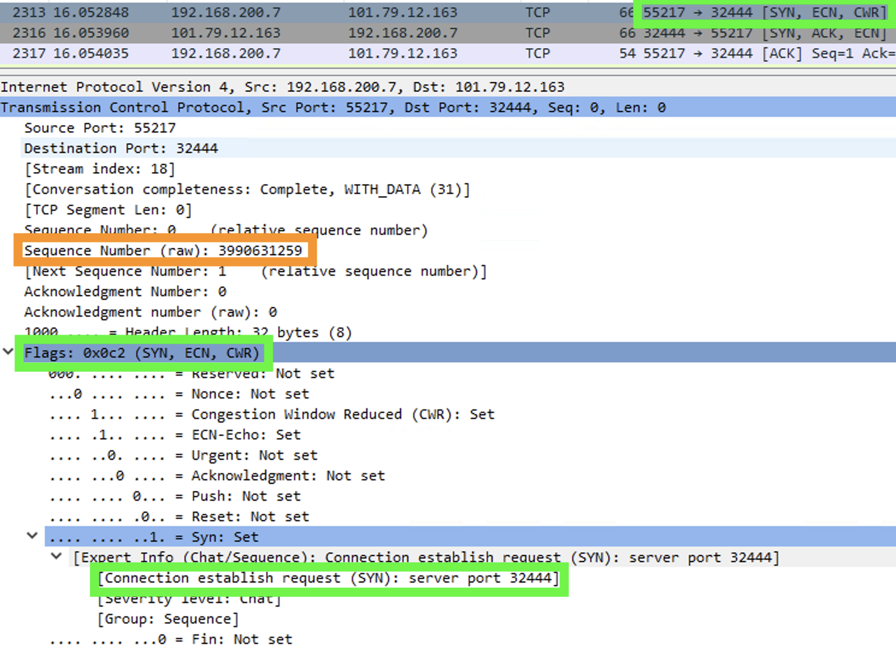
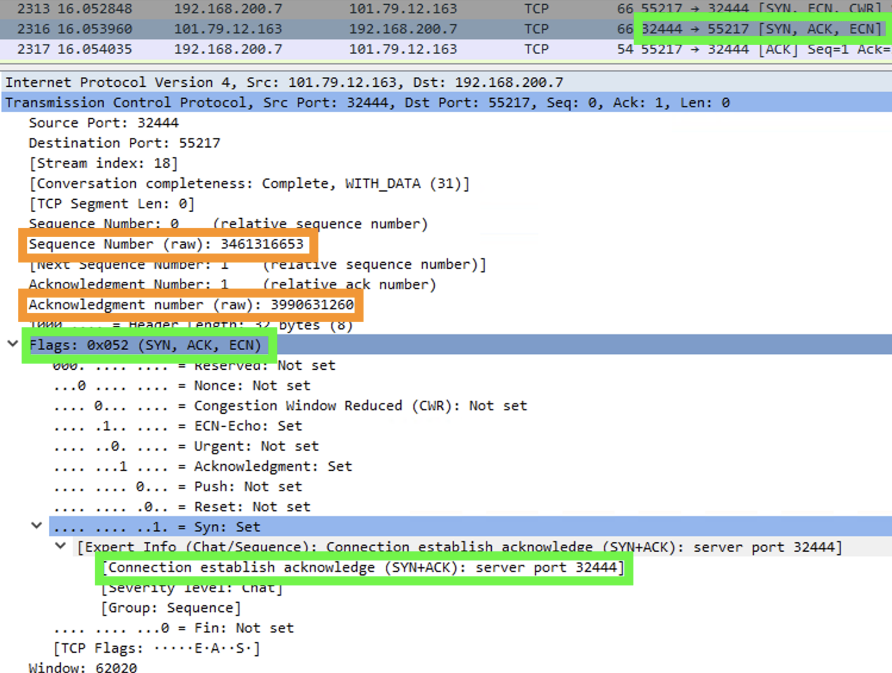
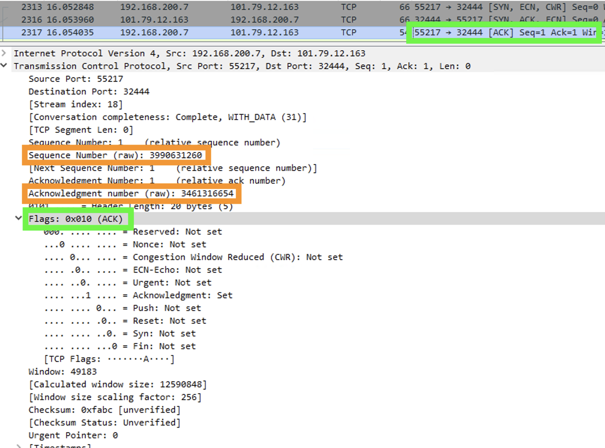
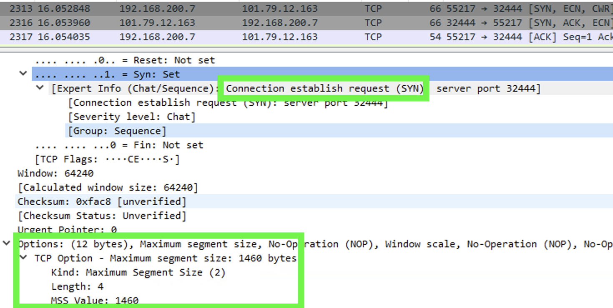
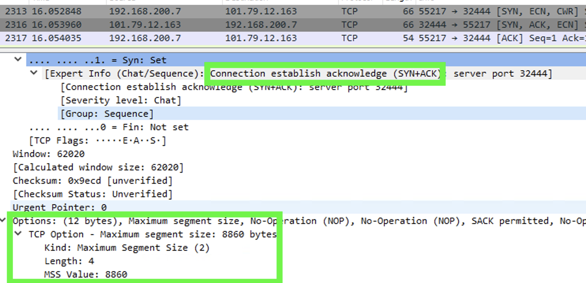

### Transport Layer
네트워크 계층의 역할은 source의 app으로부터 전송된 데이터를 destination 노드에 데려다 주는 부분까지다.  
그 이상 destination의 어떤 app으로 데이터를 전송해야 하는지는 신경쓰지 않는다.  
트렌스포트 계층은 app과 네트워크의 가교 역할을 한다.   
이를 위해, 수행하는 헤더 처리를 '세그먼트 화'라고 하며, 이를 통해 생성된 데이터를 '세그먼트'라고 한다.

트렌스포트 계층에서 가장 많이 사용하는 TCP를 알아보자.

### TCP
~~~
source: 
    private ip: 192.168.200.7

destination:    
    domain: hello-kube-lb-1-10056617-0408562b3f33.kr.lb.naverncp.com
    port: 32444

cmd: curl hello-kube-lb-1-10056617-0408562b3f33.kr.lb.naverncp.com:32444
~~~

#### 3 way hand shake
TCP는 신뢰성있는 커넥션을 보장하기 위해, 3 way hand shake 으로 통신을 시작한다.  
3 way hand shake 에서 중요한 값은 'Flags', 'Sequence', 'Options' 이다.

##### Flags
3 way hand shake의 순서는 'STN' -> 'SYN/ACK' -> 'ACK' 의 순서로 진행되며, 이 값은 flag에 담긴다.

##### Sequence
'SYN'에서 임의의 값을 'Sequence Number (raw)'에 보낸다.  
'SYN/ACK'에서 임의의 값을 'Sequence Number (raw)'에 보내고, 'SYN'에서 받은 값에 +1 하여 'Acknowledgement number (raw)'에 보낸다.  
'ACK'에서 'SYN/ACK'에서 받은 'Acknowledgement number (raw)' 값은 'Sequence Number (raw)'에 보내고, 'Sequence Number (raw)' 값에 +1 하여 'Acknowledgement number (raw)'에 보낸다. 

##### Options
Options에는 많은 값이 있지만, 'MSS'를 주목한다. Max Segment Size 이다. 3 way handshake 이후 전송할 데이터의 크기를 의미힌다.  
server, client는 서로 처리할 수 있는 크기가 다르다. 작은 값으로 통신하게 된다.

- SYN (Flags & Sequence)

- SYN/ACK (Flags & Sequence)

- ACK (Flags & Sequence)

- SYN (Options MMU)

- SYN/ACK (Options MMU)

#### TCP 통신화 효율 전략
3 way hand shake로 ESTABLISHED 상태가 되면, 이제 통신을 시작한다.  
TCP는 데이터의 신뢰성과 속도를 모두 확립하기 위해 여러 전송제어를 한다. 3가지를 다루어보자.    

'확인 응답', '재전송 제어', '흐름제어'이다.    

'확인 응답'은 server가 client에 데이터를 나누어 보내면, 나누어 보내는 데이터마다 client는 'ACK'(확인 응답)을 하는 것을 말한다.     
이를 통해, server는 client가 데이터를 수신헀는지 여부를 확인하고, 확인하지 못했다면 일정시간이 지난 후에 재전송을 한다. 이것이 '재전송 제어'이다.  
위의 '확인 응답'과 '재전송 제어'는 데이터의 신뢰성을 높이지만, 속도는 더디게 한다.   

이를 위해 TCP에서는 '흐름 제어'를 한다.  
'흐름 제어'에서는 TCP 헤더 중 'Window'가 중요하다. client는 'ACK' 시마다 수신가능한 버퍼를 'Window'에 세팅하여 전달한다.  
server는 이 값을 활용하여 여러 세그먼트를 함께 발송한다. 